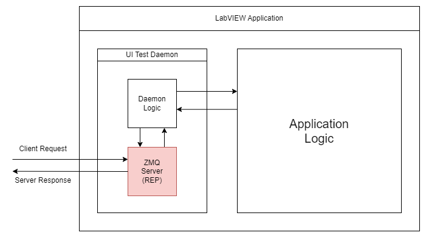

# LabVIEW User Interface Testing framework

The aim of this project is:
1. test several UI scrapping tools available and check if some can be used with a LabVIEW application. 
2. Make a framework (first in Python) to script some user interface testing

# Powered by

[![LabVIEW][LabVIEW]][LabVIEW-url]
[![Python][Python]][Python-url]
[![PythonTest][PythonTest]][PythonTest-url]
[![0MQ][0MQ]][0MQ-url]

[LabVIEW]: https://img.shields.io/badge/labview-000000?style=for-the-badge&logo=labview&logoColor=white
[LabVIEW-url]: https://www.ni.com/fr/support/downloads/software-products/download.labview.html

[Python]:https://img.shields.io/badge/python-000000?style=for-the-badge&logo=python&logoColor=white
[Python-url]:https://www.python.org/

[PythonTest]:https://img.shields.io/badge/pytest-000000?style=for-the-badge&logo=pytest&logoColor=white
[PythonTest-url]:https://docs.pytest.org/

[0MQ]:https://img.shields.io/badge/Ømq-000000?style=for-the-badge&logo=0mq&logoColor=white
[0MQ-url]:https://zeromq.org/

# How does it work ?

## LabVIEW

The UI test dameon is launched from one VI called "[start daemon.vi](./src/lv/ui-testing/start%20daemon.vi)". This daemon will start a 0MQ server that will waits for request from any script. The daemon logic is used to convert the command from the client to UI methods such as clicking on a button or getting/setting a value for example. 

## Python

The python package will create a 0MQ client when called and will send the different request to the LabVIEW application. The idea is to used  PyTest to write the different UI test but the package can be used in any custom way.

# License

Distributed under the MIT License. See [LICENSE.txt](./LICENSE.txt) for more information. Copyrights Thomas Zilliox and others.

# Roadmap

## 2.0.0

* Support of the webview2 control handling
* Support of the path control handling

## 1.5.0
* Support for the controls visibility within a cluster
* Support for the update of strings within clusters
* Refactoring of the python code and examples to increase readability and Developer Experience overall

## 1.4.0
* Fixing of missing dependencies

## 1.3.1
* Support for read and write of some clusters data types
* Support for the controls visibility within a VI

## 1.2.0

* Support for sub-subpanel

## 1.1.0

* Support of the string control handling
    * Set the value directly similarly of the double control in 1.0.0
    * Simulate a user typing

* Support of the array string control handling (such as tree with multiple inputs)
    * Set the value directly similarly of the double control in 1.0.0
    * Simulate a user typing

## 1.0.0

* A VI call "[start daemon.vi](./src/lv/ui-testing/start%20daemon.vi)" need to be added to top level VI. This subVI will encapsulate all the logic needed.
* A python package called "[lv_ui_testing](./src/python/lv_ui_testing/)" is made to encapsulate some generic commands
* The commands are as follow:
    * Front Most VI
        * Click on button
        * Get value of a control
        * Get VI name
        * Set DBL value of a control
    * Subpanel
        * Click on button
        * Get value of a control
        * Get VI name currently displayed in the subpanel
        * Set DBL value of a control
